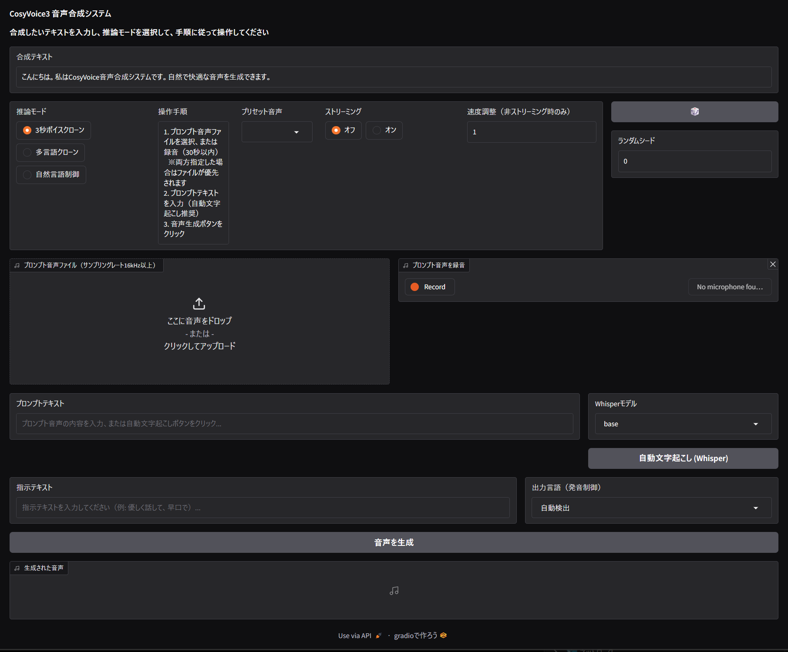

# CosyVoice-JP

CosyVoice3 縺ｮ譌･譛ｬ隱槫ｯｾ蠢懊ヵ繧ｩ繝ｼ繧ｯ迚・- Windows 繝阪う繝・ぅ繝門ｯｾ蠢・+ Whisper 閾ｪ蜍墓枚蟄苓ｵｷ縺薙＠邨ｱ蜷・

## 迚ｹ蠕ｴ

- **GUI螳悟・譌･譛ｬ隱槫喧**: 縺吶∋縺ｦ縺ｮUI隕∫ｴ繧呈律譛ｬ隱槭↓鄙ｻ險ｳ
- **Whisper閾ｪ蜍墓枚蟄苓ｵｷ縺薙＠**: 繝励Ο繝ｳ繝励ヨ髻ｳ螢ｰ縺ｮ蜀・ｮｹ繧定・蜍輔〒繝・く繧ｹ繝亥喧
- **Windows繝阪う繝・ぅ繝門ｯｾ蠢・*: DLL繝ｭ繝ｼ繝牙撫鬘後€》orchcodec蝠城｡後ｒ隗｣豎ｺ
- **繝ｯ繝ｳ繧ｯ繝ｪ繝・け襍ｷ蜍・*: run.bat 繧偵ム繝悶Ν繧ｯ繝ｪ繝・け縺吶ｋ縺縺代〒襍ｷ蜍・- **閾ｪ蜍輔・繝ｼ繝磯∈謚・*: 菴ｿ逕ｨ荳ｭ縺ｮ繝昴・繝医ｒ閾ｪ蜍募屓驕ｿ

## 蜈・Μ繝昴ず繝医Μ縺九ｉ縺ｮ螟画峩轤ｹ

| 繝輔ぃ繧､繝ｫ | 螟画峩蜀・ｮｹ |
|----------|----------|
| webui.py | GUI譌･譛ｬ隱槫喧縲仝hisper邨ｱ蜷医€仝indows莠呈鋤諤ｧ菫ｮ豁｣ |
| launcher.py | 閾ｪ蜍輔・繝ｼ繝磯∈謚槭€√ヶ繝ｩ繧ｦ繧ｶ閾ｪ蜍戊ｵｷ蜍包ｼ域眠隕擾ｼ・|
| run.bat | 繝ｯ繝ｳ繧ｯ繝ｪ繝・け襍ｷ蜍輔せ繧ｯ繝ｪ繝励ヨ・域眠隕擾ｼ・|
| cosyvoice/utils/file_utils.py | torchcodec蝠城｡後・蝗樣∩繝代ャ繝・|

## 蜍穂ｽ懃腸蠅・
- OS: Windows 10/11
- GPU: NVIDIA GPU・・UDA蟇ｾ蠢懶ｼ・- Python: 3.10
- 迚ｹ險・ RTX 5090 蟇ｾ蠢懶ｼ・yTorch nightly cu128・・
## 繧､繝ｳ繧ｹ繝医・繝ｫ謇矩・
### 1. 繝ｪ繝昴ず繝医Μ縺ｮ繧ｯ繝ｭ繝ｼ繝ｳ

git clone --recursive https://github.com/hiroki-abe-58/CosyVoice-JP.git
cd CosyVoice-JP
git submodule update --init --recursive

### 2. Conda迺ｰ蠅・・菴懈・

conda create -n cosyvoice3 python=3.10 -y
conda activate cosyvoice3

### 3. 萓晏ｭ倬未菫ゅ・繧､繝ｳ繧ｹ繝医・繝ｫ

# PyTorch・・UDA 12.8蟇ｾ蠢懶ｼ・pip install --pre torch torchvision torchaudio --index-url https://download.pytorch.org/whl/nightly/cu128

# 縺昴・莉・pip install -r requirements.txt
pip install openai-whisper soundfile
pip install "ruamel.yaml>=0.15.0,<0.18.0"

### 4. 繝｢繝・Ν縺ｮ繝€繧ｦ繝ｳ繝ｭ繝ｼ繝・
from huggingface_hub import snapshot_download
snapshot_download('FunAudioLLM/Fun-CosyVoice3-0.5B-2512', 
                  local_dir='pretrained_models/Fun-CosyVoice3-0.5B-2512')

### 5. 襍ｷ蜍・
run.bat 繧偵ム繝悶Ν繧ｯ繝ｪ繝・け

## 繝ｩ繧､繧ｻ繝ｳ繧ｹ

- CosyVoice: Apache License 2.0 (c) Alibaba Inc
- Whisper: MIT License (c) OpenAI

## 蜈崎ｲｬ莠矩・
譛ｬ繧ｽ繝輔ヨ繧ｦ繧ｧ繧｢縺ｯ縲檎樟迥ｶ縺ｮ縺ｾ縺ｾ縲肴署萓帙＆繧後∪縺吶€る浹螢ｰ繧ｯ繝ｭ繝ｼ繝ｳ謚€陦薙・謔ｪ逕ｨ縺ｯ蝗ｺ縺冗ｦ√§縺ｾ縺吶€・逕滓・縺輔ｌ縺滄浹螢ｰ縺ｮ蛻ｩ逕ｨ縺ｯ蛻ｩ逕ｨ閠・・霄ｫ縺ｮ雋ｬ莉ｻ縺ｫ縺翫＞縺ｦ陦後▲縺ｦ縺上□縺輔＞縲・
## 隰晁ｾ・
蜈・Μ繝昴ず繝医Μ: https://github.com/FunAudioLLM/CosyVoice
